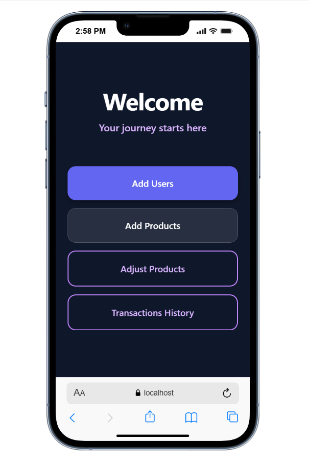
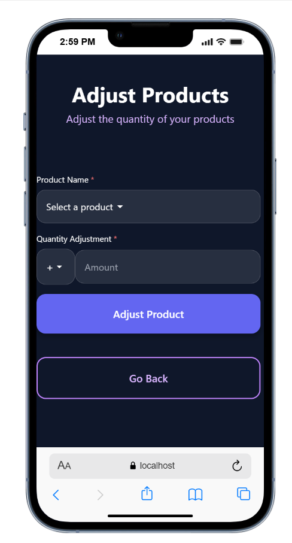
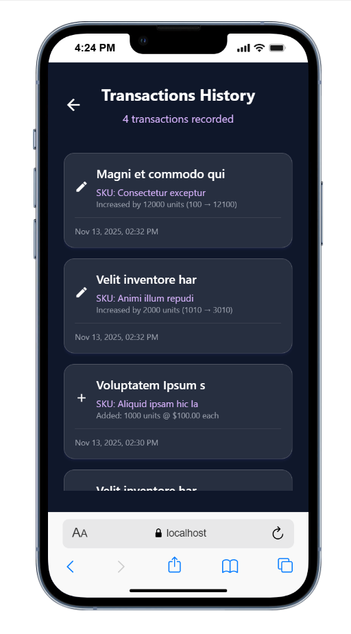

# 🚀 Product & User Management App

<div align="center">
  
</div>

A React Native application built with **Expo** and **Tailwind CSS (NativeWind)** for managing products, users, and transactions. This app provides a complete inventory management system with local storage capabilities.

---

## 📦 Features

- ✅ **Expo Router** for file-based navigation
- 🎨 **Tailwind CSS** support via NativeWind for modern styling
- 👥 **User Management** - Add and view users
- 📦 **Product Management** - Add, view, edit, and adjust product inventory
- 📊 **Transaction History** - Track all product transactions
- 💾 **Local Storage** - Data persistence using AsyncStorage
- 🎯 **TypeScript** - Full type safety
- 🧩 **Themed Components** - Support for light/dark mode
- 🛠 Clean and organized project structure
- 📱 Supports Android, iOS, and Web

---

## 📁 Project Structure

```
test-project
├── app/                    # Expo Router pages
│   ├── (tabs)/            # Tab navigation screens
│   │   ├── index.tsx      # Home screen
│   │   └── explore.tsx    # Explore screen
│   ├── add-users.tsx      # Add users screen
│   ├── add-products.tsx   # Add products screen
│   ├── show_users.tsx     # View users screen
│   ├── show_products.tsx  # View products screen
│   ├── adjust-products.tsx # Adjust product quantities
│   ├── transactions-history.tsx # Transaction history
│   └── _layout.tsx        # Root layout
├── components/            # Reusable components
│   ├── ThemedText.tsx    # Themed text component
│   ├── ThemedView.tsx    # Themed view component
│   ├── Collapsible.tsx   # Collapsible component
│   ├── Toast.tsx         # Toast notification component
│   └── ui/               # UI components
├── hooks/                # Custom React hooks
│   ├── useColorScheme.ts # Color scheme hook
│   └── useThemeColor.ts  # Theme color hook
├── constants/            # App constants
│   └── Colors.ts         # Color definitions
├── assets/               # Images, fonts, etc.
├── tailwind.config.js    # Tailwind configuration
├── babel.config.js       # Babel configuration
├── tsconfig.json         # TypeScript configuration
└── package.json          # Dependencies
```

---

## 🚀 Getting Started

<div align="center">
  
</div>

### Prerequisites

- Node.js (v18 or higher)
- npm or yarn
- Expo CLI (installed globally or via npx)
- Expo Go app on your mobile device (for testing)

### Installation

1. **Clone the repository**

```bash
git clone <repository-url>
cd test-project
```

2. **Install dependencies**

```bash
npm install
# or
yarn install
```

3. **Start the development server**

```bash
npm start
# or
npx expo start
```

4. **Run on your preferred platform**

```bash
# iOS
npm run ios
# or
npx expo start --ios

# Android
npm run android
# or
npx expo start --android

# Web
npm run web
# or
npx expo start --web
```

Then scan the QR code with the Expo Go app on your device, or press the corresponding key to open in an emulator.

---

## 🎯 Key Features Explained

### User Management
- Add new users with name and email
- View all registered users
- Data stored locally using AsyncStorage

### Product Management
- Add products with name, price, SKU, and quantity
- View all products in a searchable list
- Edit product details
- Adjust product quantities (increase/decrease)
- Automatic transaction logging

### Transaction History
- View all product transactions
- Filter by transaction type (add, adjust, etc.)
- See transaction timestamps and details

---

## 🛠 Technologies Used

- **Expo** (~53.0.13) - React Native framework
- **Expo Router** (~5.1.3) - File-based routing
- **React Native** (0.79.4) - Mobile framework
- **TypeScript** (~5.8.3) - Type safety
- **NativeWind** (^4.1.23) - Tailwind CSS for React Native
- **AsyncStorage** (^2.2.0) - Local data persistence
- **React Navigation** (^7.1.6) - Navigation library
- **React Native Reanimated** (~3.17.4) - Animations
- **Zod** (^4.1.12) - Schema validation

---

## 🧠 How Tailwind (NativeWind) Works

This project uses [NativeWind](https://www.nativewind.dev/) — a library that brings Tailwind CSS to React Native.

Tailwind classes can be used directly in the `className` prop:

```tsx
<View className="flex-1 items-center justify-center bg-slate-900">
  <Text className="text-white text-lg font-bold">Hello, NativeWind!</Text>
</View>
```

---

## 📝 Available Scripts

- `npm start` - Start the Expo development server
- `npm run android` - Run on Android emulator/device
- `npm run ios` - Run on iOS simulator/device
- `npm run web` - Run in web browser
- `npm run lint` - Run ESLint

---

## 📄 Useful Documentation

* 📘 [Expo Documentation](https://docs.expo.dev/)
* 🧭 [Expo Router Documentation](https://docs.expo.dev/router/introduction/)
* 💨 [Tailwind CSS](https://tailwindcss.com/docs)
* 🌬 [NativeWind Docs](https://www.nativewind.dev/)
* ⚛️ [React Native Documentation](https://reactnative.dev/)

---

## 🔧 Configuration

### Path Aliases

The project uses TypeScript path aliases configured in `tsconfig.json`:

```json
{
  "compilerOptions": {
    "paths": {
      "@/*": ["./*"]
    }
  }
}
```

This allows imports like:
```tsx
import { useColorScheme } from '@/hooks/useColorScheme';
import { Colors } from '@/constants/Colors';
```

---

## 📱 App Screens

- **Home** - Main navigation hub
- **Add Users** - Create new user accounts
- **Add Products** - Add new products to inventory
- **Show Users** - View and manage users
- **Show Products** - View and edit products
- **Adjust Products** - Modify product quantities
- **Transactions History** - View all transaction logs

<div align="center">
  
</div>

---

## 🐛 Troubleshooting

### Module Resolution Errors

If you encounter module resolution errors:
1. Clear the Metro bundler cache: `npx expo start -c`
2. Delete `node_modules` and reinstall: `rm -rf node_modules && npm install`
3. Restart the development server

### Common Issues

- **"Unable to resolve module"** - Ensure all dependencies are installed and path aliases are correctly configured
- **Build errors** - Clear cache and rebuild: `npx expo start -c`

---

## 📄 License

MIT License — free to use and modify.

---

## 🤝 Contributing

Contributions are welcome! Feel free to open issues or submit pull requests.

---

## ⭐️ Support

If you find this project helpful, give it a ⭐️ on GitHub!

